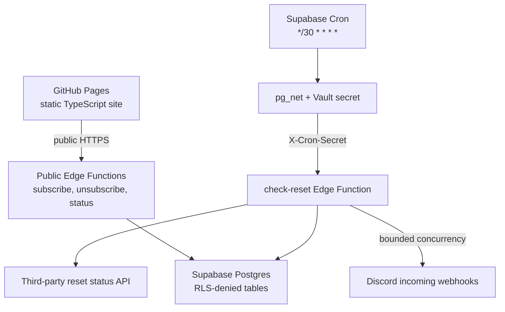

# Codex Reset Alerts

Get notified in Discord when Codex limits appear to have reset.

Codex Reset Alerts is a production-minded, account-free community service. A static GitHub Pages site accepts Discord incoming webhooks through narrowly scoped Supabase Edge Functions. Supabase Cron performs one global status check every 30 minutes and fans out an alert only when the third-party tracker exposes a new, stable reset identity.

> Unofficial community project. Not affiliated with or endorsed by OpenAI or Discord. Reset information is provided by a third-party source and may be delayed or inaccurate.

## 1. Architecture summary



- GitHub Pages hosts only compiled HTML, CSS, and JavaScript.
- Public functions validate and rate-limit requests before privileged database work.
- Postgres is the source of truth for subscriptions, status, reset identities, and delivery claims.
- `pg_cron` invokes exactly one checker every 30 minutes through `pg_net`; GitHub Actions is not involved in monitoring.
- A newly inserted `reset_events.reset_identifier` creates at most one delivery row per active subscription.
- Delivery rows are claimed before Discord is called. Claimed rows are never automatically reclaimed, preserving the no-duplicate invariant across crashes and overlapping invocations.

See [architecture.md](docs/architecture.md) for the sequence and failure model.

## 2. Security decisions

- **Webhook storage:** URLs are encrypted with AES-256-GCM in the Edge Function before insertion. The key exists only as an Edge Function secret and is separate from the database.
- **Vault scope:** Vault stores the project URL and cron authentication secret used inside Postgres. Creating one Vault object per subscriber would make rotation, deletion, and high-volume fan-out unnecessarily complex; encrypted database columns are a better fit for per-subscription credentials.
- **Duplicate fingerprint:** HMAC-SHA-256 over the normalized URL provides deterministic duplicate detection without placing a raw or naïvely hashed webhook credential in the database.
- **Unsubscribe credential:** A random 256-bit base64url token is shown once; only its SHA-256 hash is stored.
- **SSRF:** webhook destinations are parsed twice (subscription and delivery), require HTTPS, an exact approved Discord hostname, no credentials/query/fragment/alternate port, and a strict webhook path. All fetches use the canonical `discord.com` URL with redirects disabled.
- **Database exposure:** every application table has RLS enabled, no anon/authenticated policy, explicit privilege revocation, and service-role-only RPC grants.
- **Cron authentication:** `check-reset` has no public trigger capability without the independent `CRON_SECRET`, compared in constant time. The secret is encrypted in Vault for the database caller and configured separately as an Edge Function secret.
- **At-most-once alerts:** an outbound alert is not retried after a network timeout or 5xx because the remote side effect could have happened. Explicit Discord 429 responses can be retried once after the advertised delay because Discord rejected that request.
- **Abuse control:** the public write endpoints use database-backed fixed-window rate limits keyed by an HMAC of the apparent client address. Raw IP addresses are never stored and buckets expire after two days.
- **CORS:** only configured production and local origins receive browser access. CORS is defense in depth, not authentication.

See [security.md](docs/security.md) for the threat model and review.

## 3. Complete repository tree

```text
.
├── .github/workflows/deploy-pages.yml
├── .gitignore
├── README.md
├── docs/
│   ├── api.md
│   ├── architecture.md
│   ├── deployment-checklist.md
│   └── security.md
├── supabase/
│   ├── config.toml
│   ├── functions/
│   │   ├── .env.example
│   │   ├── _shared/
│   │   │   ├── concurrency.ts
│   │   │   ├── cors.ts
│   │   │   ├── crypto.ts
│   │   │   ├── db.ts
│   │   │   ├── discord.ts
│   │   │   ├── env.ts
│   │   │   ├── logging.ts
│   │   │   ├── rate-limit.ts
│   │   │   ├── responses.ts
│   │   │   ├── status-source.ts
│   │   │   ├── types.ts
│   │   │   └── *.test.ts
│   │   ├── check-reset/index.ts
│   │   ├── status/index.ts
│   │   ├── subscribe/index.ts
│   │   └── unsubscribe/index.ts
│   ├── migrations/
│   │   ├── 202608250001_initial_schema.sql
│   │   ├── 202608250002_private_operations.sql
│   │   └── 202608250003_cron_and_retention.sql
│   └── tests/database/001_security_and_idempotency.test.sql
└── web/
    ├── .env.example
    ├── index.html
    ├── package.json
    ├── package-lock.json
    ├── public/favicon.svg
    ├── src/
    │   ├── api.ts
    │   ├── config.ts
    │   ├── dom.ts
    │   ├── dom.test.ts
    │   ├── main.ts
    │   ├── styles.css
    │   ├── unsubscribe.ts
    │   └── vite-env.d.ts
    ├── tsconfig.json
    ├── unsubscribe/index.html
    └── vite.config.ts
```

## 4. Source files

All source files are included in the repository in full. Shared Edge modules are split by responsibility, public handlers contain only endpoint orchestration, and the frontend has separate transport, configuration, DOM, and page-entry modules. There are no omitted implementations or generated application sources.

## 5. SQL migrations

The migrations are ordered and deployable:

1. `202608250001_initial_schema.sql` creates the persistence model, checks, indexes, RLS, and privilege boundary.
2. `202608250002_private_operations.sql` creates service-role-only transactional RPCs for rate limits, subscription lifecycle, reset claiming, delivery outcomes, and status history.
3. `202608250003_cron_and_retention.sql` enables `pg_cron`, `pg_net`, and Vault; creates the Vault-backed invocation helper; schedules `*/30 * * * *`; and deletes detailed logs after 30 days.

Reset events remain indefinitely because they are the compact, stable deduplication ledger. Detailed checks and deliveries expire after 30 days.

## 6. Supabase Edge Functions

| Function | Exposure | Purpose |
|---|---|---|
| `subscribe` | Public, origin-checked, rate-limited | Strictly validates Discord destination, performs GET verification and test delivery, encrypts and upserts the subscription, returns a one-time unsubscribe token |
| `unsubscribe` | Public, origin-checked, rate-limited | Hashes a high-entropy token and atomically deactivates the matching subscription while erasing credential material |
| `status` | Public, origin-checked | Returns only `state`, `lastCheckedAt`, and `lastResetAt` |
| `check-reset` | Cron-secret only | Fetches and validates the tracker once, claims a new reset, and sends alerts with bounded concurrency |

The live source schema observed during development included `state`, nullable `resetAt`, and `automationSummary.lastReset.tweetId/checkedAt`. Parsing prefers `resetAt`, then the stable source event ID, then its stable checked timestamp. It intentionally never turns top-level `updatedAt` into a reset identity.

## 7. Frontend

The Vite app uses strict TypeScript and no runtime framework or Supabase client dependency. It calls the functions directly with `fetch`, displays sanitized errors, disables pending controls, builds an unsubscribe link locally, supports keyboard focus/reduced motion, and uses a nested `unsubscribe/index.html` so GitHub Pages serves `/CodexAlert/unsubscribe/`.

For a different repository name or custom domain, update `base` in `web/vite.config.ts` before building.

## 8. Configuration files

- `supabase/config.toml` explicitly disables gateway JWT verification for the three intentionally public functions and the independently authenticated checker.
- `web/vite.config.ts` configures the `/CodexAlert/` Pages base path and both HTML entry points.
- `.github/workflows/deploy-pages.yml` uses current GitHub Pages actions to test, build, upload, and deploy only the frontend.

The Pages workflow contains no schedule and cannot invoke the checker.

## 9. Environment examples

Public build-time value (`web/.env.local`):

```dotenv
VITE_SUPABASE_URL=https://your-project-ref.supabase.co
```

Server-only Edge Function values (`supabase/.env.production.local`, never commit):

```dotenv
ALLOWED_ORIGINS=https://cmel2.github.io,http://localhost:5173,http://127.0.0.1:5173
CRON_SECRET=replace-with-64-character-random-hex
WEBHOOK_ENCRYPTION_KEY=replace-with-base64-encoded-32-byte-key
HMAC_KEY=replace-with-base64-encoded-32-byte-key
DELIVERY_CONCURRENCY=10
PERMANENT_FAILURE_DISABLE_THRESHOLD=2
```

`SUPABASE_URL` and the server-side Supabase key are automatically provided to hosted Edge Functions. The code supports current named secret keys and legacy `SUPABASE_SERVICE_ROLE_KEY`. Never add either server-side key to `web/` or GitHub Pages variables.

Generate independent secrets:

```bash
openssl rand -hex 32
openssl rand -base64 32
openssl rand -base64 32
```

Use the first output for `CRON_SECRET`, the second for `WEBHOOK_ENCRYPTION_KEY`, and the third for `HMAC_KEY`.

## 10. Deployment instructions

Prerequisites:

- Node.js 22+
- Docker Desktop for local Supabase
- [Supabase CLI](https://supabase.com/docs/guides/local-development/cli/getting-started)
- A Supabase project and permission to configure Pages in this GitHub repository

Link and migrate:

```bash
supabase login
supabase link --project-ref YOUR_PROJECT_REF
supabase db push
```

Create `supabase/.env.production.local` from the values above, then upload only server secrets:

```bash
supabase secrets set --env-file supabase/.env.production.local --project-ref YOUR_PROJECT_REF
```

Deploy the functions:

```bash
supabase functions deploy subscribe --project-ref YOUR_PROJECT_REF
supabase functions deploy unsubscribe --project-ref YOUR_PROJECT_REF
supabase functions deploy status --project-ref YOUR_PROJECT_REF
supabase functions deploy check-reset --project-ref YOUR_PROJECT_REF
```

The `verify_jwt = false` declarations in `supabase/config.toml` deploy with the functions. Do not turn `check-reset` into an unauthenticated handler internally; gateway JWT verification is off only so `pg_net` can use the dedicated `X-Cron-Secret` protocol.

## 11. Supabase cron setup

The migration schedules `codex-alert-check-reset` at exactly:

```text
*/30 * * * *
```

It does not hard-code a URL or credential. Add the two expected Vault values in the Supabase SQL editor, using the exact same `CRON_SECRET` uploaded to Edge Functions:

```sql
select vault.create_secret(
  'https://YOUR_PROJECT_REF.supabase.co',
  'codex_alert_project_url',
  'Codex Alert Edge Function base URL'
);

select vault.create_secret(
  'PASTE_THE_SAME_CRON_SECRET_HERE',
  'codex_alert_cron_secret',
  'Codex Alert checker authentication'
);
```

Vault secret names are unique. Rotate instead of creating a duplicate:

```sql
select vault.update_secret(
  (select id from vault.secrets where name = 'codex_alert_cron_secret'),
  'PASTE_THE_NEW_CRON_SECRET_HERE'
);
```

Then update `CRON_SECRET` in Edge Function secrets in the same maintenance window.

Inspect or trigger the job:

```sql
select jobid, jobname, schedule, active
from cron.job
where jobname like 'codex-alert-%';

select public.invoke_codex_alert_check();

select status, return_message, start_time, end_time
from cron.job_run_details
order by start_time desc
limit 20;
```

Supabase officially documents this `pg_cron` + `pg_net` + Vault pattern in [Scheduling Edge Functions](https://supabase.com/docs/guides/functions/schedule-functions).

## 12. GitHub Pages setup

1. In the repository, open **Settings → Pages**.
2. Under **Build and deployment**, choose **GitHub Actions**.
3. Open **Settings → Secrets and variables → Actions → Variables**.
4. Add `VITE_SUPABASE_URL` with `https://YOUR_PROJECT_REF.supabase.co`.
5. Ensure the Edge secret `ALLOWED_ORIGINS` includes `https://cmel2.github.io` (origins never contain `/CodexAlert`).
6. Push `main` or run **Deploy GitHub Pages** manually.

The expected URL is `https://cmel2.github.io/CodexAlert/`. The workflow follows GitHub's [custom Pages workflow](https://docs.github.com/en/pages/getting-started-with-github-pages/using-custom-workflows-with-github-pages) pattern.

## 13. Local development

Start the local stack and apply migrations:

```bash
supabase start
supabase db reset
```

Copy `supabase/functions/.env.example` to the ignored `supabase/functions/.env`, replace the keys using the output of `supabase status`, and start public functions:

```bash
supabase functions serve --no-verify-jwt
```

In another terminal:

```bash
cp web/.env.example web/.env.local
cd web
npm install
npm run dev
```

The local frontend is `http://localhost:5173/CodexAlert/`. Use a disposable Discord webhook for manual integration tests and delete it afterward.

To invoke the checker manually:

```bash
curl --request POST \
  --header "X-Cron-Secret: YOUR_LOCAL_CRON_SECRET" \
  http://127.0.0.1:54321/functions/v1/check-reset
```

## 14. Testing instructions

Automated tests:

```bash
cd web
npm ci
npm test
npm run build

cd ..
deno fmt --check supabase/functions
deno test supabase/functions/_shared
supabase test db
```

The unit suite covers strict Discord URL/SSRF validation, encryption, HMAC/hashing, random tokens, status parsing and fallback behavior, bounded concurrency, 2xx/404/429/500/timeout delivery outcomes, and the changing-`updatedAt` non-trigger rule. The database suite proves RLS/privilege denial and that two claims for the same reset produce only one delivery set.

Manual integration matrix:

| Area | Cases |
|---|---|
| Subscribe | Valid webhook; malformed URL; non-Discord URL; hostname containing `discord.com`; legacy/variant approved host; deleted webhook; duplicate submission/token rotation; query/fragment/userinfo/port tricks; localhost SSRF; >500 characters |
| Unsubscribe | Valid token; malformed token; random nonexistent token; reuse of a consumed token; confirm stored ciphertext/IV/fingerprint/token hash become `NULL` |
| Checker | `no`; `yes` with new `resetAt`; same ID twice; different ID; source event fallback; no stable ID; malformed JSON; 500; timeout |
| Discord | 2xx; 404 twice disables and clears credential; 429 short retry; 429 excessive delay records failure; 500 no risky retry; network timeout no risky retry |
| Concurrency | Invoke checker twice together; assert one `reset_events` row and one `(subscription_id, reset_identifier)` delivery row |

Important database assertion:

```sql
select subscription_id, reset_identifier, count(*)
from public.notification_deliveries
group by subscription_id, reset_identifier
having count(*) > 1;
```

It must always return zero rows. Also inspect Discord to confirm the same reset produced no more than one successful alert per subscribed channel.

## 15. Security review

The implementation was reviewed for the requested classes:

- No service-role, cron, encryption, HMAC, webhook, or unsubscribe secret exists in frontend source.
- No public RLS policies or anon/authenticated table/RPC grants exist.
- Full webhooks are never logged or returned; structured logs use delivery/subscription/webhook IDs only.
- CORS reflects only configured exact origins and does not use `*`.
- The server cannot fetch an arbitrary submitted host, redirect, port, query, or userinfo URL.
- Database calls use Supabase's parameterized query/RPC interface; no SQL is built from user data.
- Unsubscribe tokens have 256 bits of randomness and are stored hashed.
- The check endpoint rejects missing/incorrect secrets before any tracker or database work.
- A unique reset event plus unique delivery constraint and transactional claim serializes overlapping jobs.
- Unknown Discord outcomes are not retried, preventing a crash/timeout from turning into a duplicate success.
- Confirmation uses `allowed_mentions.parse = []`; notifications cannot mention `@everyone`.
- Request bodies, URLs, source responses, outbound concurrency, timeouts, rate-limit delay, and retention are bounded.

Run the checks in [security.md](docs/security.md) again after any auth, host allowlist, RPC, or retry change.

## 16. Known limitations

- True exactly-once delivery across Postgres and Discord is impossible because Discord incoming webhooks do not offer a transactional or idempotency key accepted by this service. The MVP chooses **at most once**: it will not duplicate a claimed alert, but an Edge Function crash after claiming and before Discord accepts can cause a missed alert.
- A no-reset response with no historical reset timestamp makes the public “last reset” field unavailable until the source provides one during a reset observation.
- The database rate limiter is practical free-tier abuse resistance, not bot-proofing. A distributed attacker can rotate addresses. Turnstile or an edge-rate-limiting provider can be added later.
- Notification batches large enough to exceed Edge Function wall-clock limits need a durable queue/worker design. The current concurrency of 10 is suitable for an MVP and modest subscriber counts.
- Encryption-key rotation requires decrypting and re-encrypting active credentials in a controlled server-side migration. Do not delete the old key first.
- GitHub Pages cannot set arbitrary response security headers. The application contains no auth cookie or privileged browser credential, which limits impact.

At 48 checks/day, the checker performs about 1,440 source requests/month. Database/checker use is tiny on the Supabase Free plan for an MVP; new-reset Discord fan-out is the primary growth driver. Free-tier quotas can change, so verify current Supabase limits before a large launch.

## 17. Future improvements

- Durable queue-based fan-out with operator-visible stuck-claim reconciliation
- Cloudflare Turnstile or equivalent proof-of-human integration
- Admin-only health dashboard and alerts for checker/delivery failure rates
- Key-versioned webhook encryption and online rotation tooling
- Telegram, Slack, email, and browser-push delivery adapters
- Optional role mentions with explicit opt-in and restrictive allowed mentions
- Multiple tracked services and per-subscription preferences
- Status history visualization using already-bounded check data

## 18. Final deployment checklist

Use [deployment-checklist.md](docs/deployment-checklist.md) as the sign-off sheet. The minimum launch gates are:

- [ ] Supabase project linked and all three migrations applied
- [ ] Three independent secrets generated and Edge secrets uploaded
- [ ] Matching cron secret and project URL stored in Vault
- [ ] Four Edge Functions deployed with the committed `config.toml`
- [ ] `ALLOWED_ORIGINS` contains the exact GitHub Pages origin
- [ ] Cron job shows `*/30 * * * *` and a manual run reaches the function
- [ ] Valid webhook receives one confirmation and produces a saved subscription
- [ ] Repeated test reset produces no duplicate delivery row or Discord alert
- [ ] Unsubscribe clears all stored credential material
- [ ] GitHub Actions variable `VITE_SUPABASE_URL` configured
- [ ] Pages source set to GitHub Actions and production page verified on mobile/desktop
